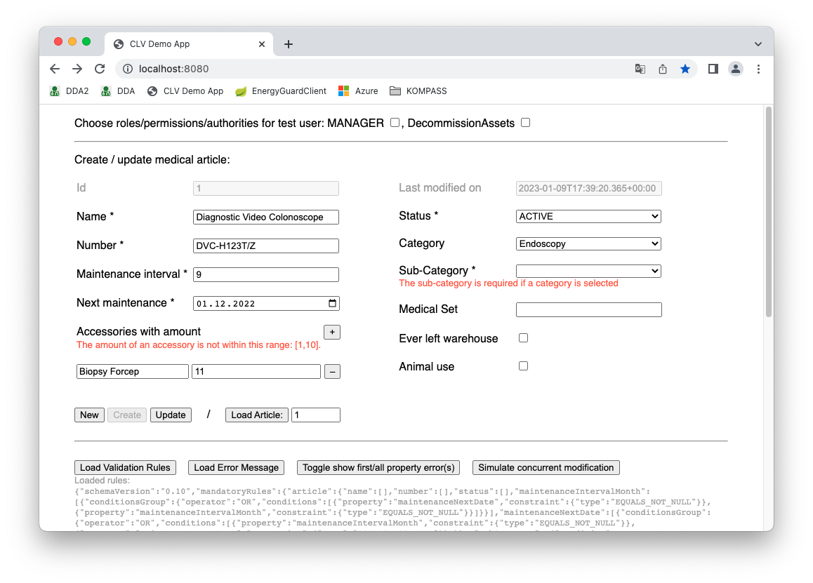

# CLV Demo Application
This is a simple demo application showing the use of the
[Cross Language Validation Framework](https://github.com/stephan-double-u/cross-language-validation-schema)
in a web application on the basis of a close-to-life example:

> Let's say we work for a company that rents medical equipment. Each medical article may contain several accessories. 
Articles are grouped in medical sets. The equipment is stored in warehouses and delivered to customers locations.

The backend is a Spring Boot application that uses the 
[CLV Java implementation](https://github.com/stephan-double-u/cross-language-validation-java) to
 - define validation rules for the _article_ entity
 - provide the serialized rules via an `GET /validation-rules` endpoint
 - validates the mandatory and content rules when an _article_ is sent via `POST /article` endpoint for creation
 - validates all rules when an _article_ is sent via `PUT /article` endpoint for update
 
The frontend is a single page app that allows the creation and update of articles. It uses 
[CLV ECMAScript 6 implementation](https://github.com/stephan-double-u/cross-language-validation-es6) to
- identify mandatory properties in order to add a visual indicator (i.e. an '*') to the input field labels
- identify immutable properties in order to disable these input fields
- identify allowed values for select boxes in order to make these value selectable
- validates mandatory and content rules if an input value changes when a new article is created
- validates all rules if an input value changes when a new article is updated

## Maven
### pom.xml
    <dependency>
      <groupId>de.swa</groupId>
      <artifactId>cross-language-validation</artifactId>
      <version>0.5.7</version>
    </dependency>

### settings.xml
Until this artifact is available on Maven Central, it can be downloaded by addinf this `server`to `settings.xml`.

Note: `<REMOVE>` must be removed from the public read access token:

    <servers>
        <server>
            <id>github</id>
            <username>stephan-double-u</username>
            <password>ghp_<REMOVE>ZvGsEK3vqGUCXcyCQAVNuUupkKBju4242QoU</password>
        </server>
    </servers>

## Usage
Build and start the application with `mvn spring-boot:run`

Open [http://localhost:8080/](http://localhost:8080/)

## Validation requirements for creating and updating articles
There is a _strict separation_ between _human use_ and _animal use_ for all medical articles (for good reasons!):

### Top priority rules
- If an article has been delivered for the first time, it has to be flagged as such (property _everLeftWarehouse_).
  - This flag must never be reset.
- The _animalUse_ property of an article must not be changed if
  - it is assigned to a medical set, or
  - it has been used once for animals (i.e. if _animalUse_ and _everLeftWarehouse_ options are set).
### Other potentially real-life rules
- The _article name_ is a mandatory property.
  - It consists of 3 to 30 characters. Leading or trailing spaces are not allowed.
  - Article name must be unique.
- The _article number_ is a mandatory property.
- The _article status_ is a mandatory property.
  - Possible status are: NEW, ACTIVE, INACTIVE, DECOMMISSIONED.
  - The initial status (during insert) is 'NEW'.
  - These status transitions are allowed for all users:
    - NEW => ACTIVE
    - NEW => INACTIVE
    - ACTIVE => INACTIVE
    - INACTIVE => ACTIVE
  - Users with the permission _DecommissionAssets_ may perform there transitions as well:
    - ACTIVE => DECOMMISSIONED
    - INACTIVE => DECOMMISSIONED
  - The status DECOMMISSIONED may no longer be changed.
- The _article category_ is an optional property.
  - Valid values are: _Endoscopy_ and _Imaging System_
- The _article sub-category_ is mandatory if a category has been entered.
  - Valid values depend on the selected category
    - For _Endoscopy_ the valid sub-categories are: _Laryngoscope_,  _Sinuscope_, _Otoscopes_
    - For _Imaging System_ the valid sub-categories are: _Camera Head_,  _Light Source_, _Video Processors_
- The property _maintenanceIntervalMonth_ is mandatory if _maintenanceLastDate_ has been entered.
- The property _maintenanceLastDate_ is mandatory if _maintenanceIntervalMonth_ has been entered.
- Each article can be assigned several accessories in a certain quantity
  - The name of each accessory must correspond to the regular expression `"^[\\p{L}][\\p{L}\\p{N} ]*$"`.
  - The accessory names have to be distinct per article.
  - The quantity of each accessory must be between 1 and 5.
  - The sum of all quantities must not exceed 20.
  - Each user can add up to 3 accessories.
  - A user with the role _MANAGER_ can add a 4th and 5th accessory.
  - Each user can update an article, although it has 4 or 5 accessories.

